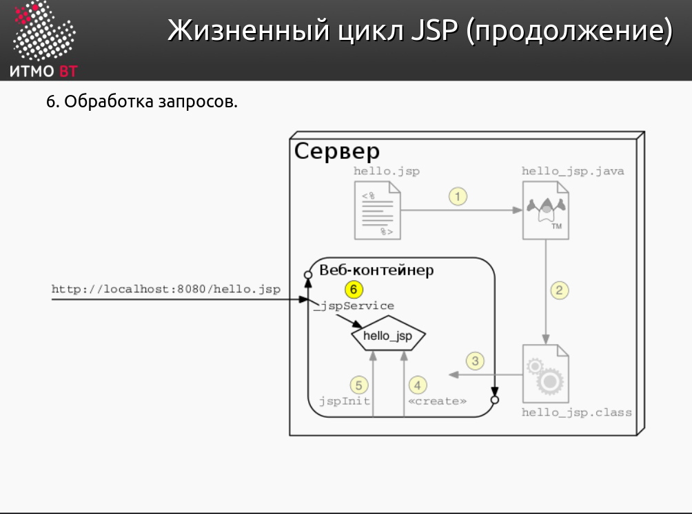

# Теория

### 1. Java-сервлеты. Особенности реализации, ключевые методы, преимущества и недостатки относительно CGI и FastCGI.

Что такое `сервлёт`? Сервлёт - это серверный сценарий, написанный на Java.  
В пакете `javax.servlet` - лежат интерфейсы и классы для создания сервлётов.

#### Особенности реализации:
- Как это работает: Браузер формирует HTTP-запрос и отправляет его на сервер. Устанавливается `TCP-соединение`. Затем, контейнер сервлётов создаёт объекты `HttpServletResuest` и `HttpServletResponse`. Экземпляры этих классов передаются методу `service`, чтобы обработать входящий запрос.
- Сервлёт формирует ответ и записывает его в поток вывода `HttpServletResponse`.

#### Ключевые методы
1. `GenericServlet` - базовая протокол-независимая реализация интерфейса `Servlet`. Предоставляет реализацию для всех методов `Servlet`, кроме service()
- **init()** - инициализация сервлёта
- **log()** - из `ServletContext`, метод чтоб записать сообщение в лог файл сервлёта
- **destroy()** - вызывается при завершении работы сервлёта
- **getServletConfig()** - вернёт объект `ServletConfig` (параметры инициализации + контекст сервлёта)
- **getServletInfo()** - вернёт строку с информацией о сервлёте (автор, версия, e.t.c.)

3. `HttpServlet` - наследуется от `GenericServlet`, расширяя его функциональность для обработки HTTP-запросов:
- **doGet(req, res)**
- **doPost(req, res)**
- **doPut(req, res)**
- **doDelete(req, res)**
> There's almost no reason to override the `service` method. It handles standard HTTP requests by dispatching them to the handler methods for each HTTP request type (the doXXX methods listed above).

4. `FacesServlet` - ключевой сервлёт в фреймворке JSF. Обрабатывает все запросы к JSF-страницам, обеспечивая жизненный цикл этого фреймфорка.

#### Summary:
- `GenericServlet` - базовая протокол-независимая реализация `Servlet`, для создания достаточно преопределить `service()`
- `HttpServlet` - его наследник, http-ориентированная реализация сервлёта
- `FacesServlet` - нужен для обработки жизненного цикла `JSF`, скрывая детали реализации.

#### Servlets vs CGI vs FastCGI

В отличие от CGI, запросы обрабатыватся в отдельных потоках(а не процессах) на веб-контейнере.  
`"+"`: Сервлёты быстрее, лучше масштабируются, безопасны, платформенно-независимы, легко отлаживать  
`"-"`: Слабое разеделние уровня представления и бизнес-логики, возможны конфликты при параллельной обработке запросов


### 2. Контейнеры сервлетов. Жизненный цикл сервлета.

`Контейнер сервлетов` — программа, представляющая собой сервер, который занимается системной поддержкой сервлетов и обеспечивает их жизненный цикл в соответствии с правилами, определёнными в спецификациях.

#### Жизненный цикл

- В случае отсутствия сервлета в контейнере.
1. Класс сервлета загружается контейнером.
2. Контейнер создает экземпляр класса сервлета.
3. Контейнер вызывает метод init().
- Обслуживание клиентского запроса. Каждый запрос обрабатывается в своем отдельном потоке. Контейнер вызывает метод service() для каждого запроса. Этот метод определяет тип пришедшего запроса и распределяет его в соответствующий этому типу метод для обработки запроса. Разработчик сервлета должен предоставить реализацию для этих методов. Если поступил запрос, метод для которого не реализован, вызывается метод родительского класса и обычно завершается возвращением ошибки инициатору запроса.
- В случае если контейнеру необходимо удалить сервлет, он вызывает метод destroy(), который снимает сервлет из эксплуатации. Подобно методу init(), этот метод тоже вызывается единожды за весь цикл сервлета.


### 3. Диспетчеризация запросов в сервлетах. Фильтры сервлетов.

#### Диспетчеризация
- Сервлеты могут делегировать обработку запросов
другим ресурсам (сервлетам, JSP и HTML-страницам).
- Диспетчеризация осуществляется с помощью реализаций интерфейса
`javax.servlet.RequestDispatcher`.
- Два способа получения `RequestDispatcher` — через
`ServletRequest` (абсолютный или относительный URL) и `ServletContext` (только абсолютный URL).
- Два способа делегирования обработки запроса — `forward` и `include`
> `forward` - полностью передаёт управление, тогда как `include` позволяет исходному сервлету генерировать и изменят ответ
> в `include` - атрибуты запроса не сохраняются после возврата управления исходному сервлёту.
> Он нужен для повторяющегося контента.

#### Фильтры

- Фильтры позволяют осуществлять пред- и
постобработку запросов до и после передачи их ресурсу
(сервлету, JSP или HTML-странице).
- Пример предобработки — допуск к странице только
  авторизованных пользователей.
- Пример постобработки — запись в лог времени
  обработки запроса.
- `FilterChain` - буквально, цепочка фильтров. Позволяет последовательно обрабатывать запрос.
- Фильтры в FilterChain вызываются в порядке, в котором они были определены в файле конфигурации web.xml или аннотациями.
- Каждый фильтр выполняет свою задачу и затем передает управление следующему фильтру в цепочке, вызывая метод `doFilter()` из объекта `FilterChain`.

##### Сервлетные фильтры могут:

- перехватывать инициацию сервлета прежде, чем сервлет будет инициирован;
- определить содержание запроса прежде, чем сервлет будет инициирован;
- модифицировать заголовки и данные запроса, в которые упаковывается поступающий запрос;
- модифицировать заголовки и данные ответа, в которые упаковывается получаемый ответ;
- перехватывать инициацию сервлета после обращения к сервлету.


### 4. HTTP-сессии - назначение, взаимодействие сервлетов с сессией, способы передачи идентификатора сессии.

`Http-сессия` - соединение, устанавливаемое между клиентом и веб-сервером, устанавливаемое на некоторое (настраиваемое) время после последнего обращения.
- при первом обращении клиента к приложению создаётся экземпляр `HttpSession` и идентификатор сессии либо помещается в cookie, либо добавляется к URL.
- Если удалить этот идентификатор, то сервер не сможет идентифицировать клиента и создаст новую сессию.
- Чтобы получить сессию - `getSession()` у `HttpServletRequest`
- В сессии можно хранить данные, к примеру, в сессии часто хранят корзину товаров. (`setAttribute()`, `getAttribute()`, `removeAttribute()`)
```java
Cookie c = new Cookie (name, value);
public interface HttpSession {
    public void invalidate();
    ...
}
```
### 5. Контекст сервлета - назначение, способы взаимодействия сервлетов с контекстом.

- Это API, c помощью которого сервлет может взаимодействовать со своим контейнером.
- доступ к методам через интерфейс `javax.servlet.ServletContext`
- Что важно понимать, контекст работает на уровне приложения, т.е. он *общий для всех сервлётов*
- Соответственно, туда можно помещать общую для всех сервлётов информацию (getAttribute, setAttribute)
- log(), getServlet(), getServletNames(), ...

### 6. JavaServer Pages. Особенности, преимущества и недостатки по сравнению с сервлетами, область применения.

`Jsp` - технология, позволяющая веб-разработчикам создавать содержимое, которое имеет как статические, так и динамические компоненты, (а так же позволяющая отделить бизнес-логику от уровня представления)

#### Особенности

- `JSP` = HTML + динамическая часть на языке выражений
- в `JSP` можно вставлять код на `Java`, что может сильно упростить обработку
- Поддерживается EL - `Expression Language` для удобной работы с данными
- Поддерживаются `шаблонизацию страниц`

#### Преимущества над сервлётами

- с помощью JSP можно удобно создавать динамические страницы и использовать в них данные (к примеру, Bean-компонент)
- Позволяют отделить бизнес-логику от логики представления
- Трудно отлаживать, если много JSP (поэтому надо использовать MVC/Model view 2, чтобы отделять сервлёты от jsp)

### Недостатки перед сервлётами

- Jsp транспилируется в java. Это 1 лишнее действие, дальше он также интерпретируется в байт-код, как и остальные сервлёты. (типа медленнее сервлётов)
- Для сложных операций и обработки бизнес-логики использование JSP может быть неудобно. Здесь лучше подходят сервлеты.
- Вставка Java-кода напрямую в JSP может привести к уязвимостям.

### Область применения

- Jsp идеально подходит для создания простых веб-приложений
- Если приложение потяжелее, там преимущественно используются сервлёты

### 7. Жизненный цикл JSP.

 
#### 1. Страница JSP `загружается в память` сервера и Jasper `транслирует` jsp в сервлёт

#### 2. Cервлёт компилируется в `байт-код` JVM

#### 3. Веб-контейнер загружает сервлёт

#### 4. При первом обращении веб-контейнер создаёт экземпляр сервлёта

#### 5. Инициализация сервлёта (Веб-контейнер вызывает `init()`)

#### 6. Сервлёт начинает обрабатывать запросы (Веб-контейнер использует `service(req, res)`)


#### 7. Сервлёт заканчивает своё существование (Веб-контейнер вызывает `destroy()`)


### 8. Структура JSP-страницы. Комментарии, директивы, объявления, скриптлеты и выражения.

#### В JSP существуют три типа комментариев:

1. HTML-комментарии: Эти комментарии видимы на стороне клиента, если пользователь решит посмотреть исходный код страницы.

```html
<!-- This is an HTML comment -->
```

2. JSP-комментарии: Эти комментарии удаляются на этапе компиляции JSP в сервлеты, и поэтому они не видны на стороне клиента.

```jsp
<%-- This is a JSP comment --%>
```

3. Java-комментарии в скриптлетах: Так как это обычные Java-комментарии, они не появляются в сгенерированном HTML-коде, но остаются в скомпилированном байт-коде сервлета. Они не будут видны на стороне клиента.

```jsp
<% // This is a Java single-line comment %>
<% /* This is a Java multi-line comment */ %>
```

##### Отличия

- `Видимость`: HTML-комментарии видны в исходном коде страницы на стороне клиента, в то время как JSP- и Java-комментарии не появляются в клиентском коде.
- `Этап удаления`: JSP-комментарии удаляются на этапе трансляции JSP в сервлет, а Java-комментарии остаются в скомпилированном байт-коде (но они не влияют на выполнение).
- `Область применения`: HTML-комментарии применимы только к HTML-коду. Java-комментарии используются внутри скриптлетов. JSP-комментарии могут применяться на всей странице и охватывать любой тип контента, включая HTML, JSP-код и скриптлеты.

#### Директивы

- Директивы в JSP странице приводят к тому, что контейнер `пошлёт заявку` на исполнение определённой службы, которая в генерированном документе не объявляется.
- Самые популярные директивы: `page`, `include`, и `taglib`.

```java
<%@ page contentType="text/html;charset=UTF-8" %>
<%@ include file="header.jsp" %>
<%@ taglib prefix="core" uri="http://java.sun.com/jsp/jstl/core" %>
```

#### Объяления

- Объявления используются для определения переменных и методов, доступных на всей странице.

```java
<%! int counter = 0; %>
<%! int incrementCounter() { return ++counter; } %>
```

#### Скриптлеты

- Позволяют встраивать `Java-код` в JSP

```java
<%
    String name = request.getParameter("name");
    out.println("Hello, " + name);
%>
```

#### Выражения

- Выражения используются для вставки значений переменных в HTML-код.

```java
<%= name %> <!-- Это выведет значение переменной name -->
```

### 9. Правила записи Java-кода внутри JSP. Стандартные переменные, доступные в скриптлетах и выражениях.

#### Правила записи

- Код должен быть заключен в `<% %>` для скриптлетов или `<%= %>` для выражений.

```java
<% 
  Java-код 
	   %>
```

- Код в скриптлетах выполняется в методе `jspService()`, поэтому избегайте использования ключевых слов `return`, `static`, или `new`.

#### Стандартные переменные

- `request`: объект `HttpServletRequest`
- `response`: объект `HttpServletResponse`
- `session`: объект `HttpSession`
- `application`: объект `ServletContext`
- `out`: объект `JspWriter` для вывода на страницу

##### Пример использования

```java
<%
    String paramValue = request.getParameter("paramName");
    session.setAttribute("key", "value");
%>
```

### 10. Bean-компоненты и их использование в JSP.  

#### Bean-компонент это простой Java-класс, соответствующий определенным соглашениям:

- Имеет `публичный конструктор` без аргументов
- `Приватные поля` данных, доступ к которым через геттеры и сеттеры
- Должен быть `сереализуем`
- Должен переопределять `equals()`, `hashCode()`, `toString()`

##### Пример:

```java
// JavaBean Example
public class UserBean {
  private String name;
  public UserBean() {}
  public String getName() {
    return name;
  }
  public void setName(String name) {
    this.name = name;
  }
}
```

#### Использование в JSP:

```xml
<!-- JSP Example -->
<jsp:useBean id="user" class="UserBean"/>
<jsp:setProperty name="user" property="name" value="John"/>
<p>Name:
<jsp:getProperty name="user" property="name"/>
</p>
```

`Доп.инфа`:

1. **Scope**: Область видимости bean-компонента может быть установлена через атрибут `scope` в `<jsp:useBean>`.
  - Варианты: `page`, `request`, `session`, `application`.

```xml
<jsp:useBean id="user" class="UserBean" scope="session"/>
```

2. **Type vs Class**: Вы можете использовать `type` для указания интерфейса, которому должен соответствовать bean,
   а `class` для конкретной имплементации.

```xml
<jsp:useBean id="user" class="com.example.UserImpl" type="com.example.UserInterface"/>
```

3. **Lazy Instantiation**: Если bean не найден в указанной области видимости, JSP страница попытается его создать. Это
   можно контролировать через атрибут `type`.

4. **Thread-Safety**: Если bean находится в области видимости `session` или `application`, убедитесь, что
   он `потокобезопасен`.

### 11. Стандартные теги JSP. Использование Expression Language (EL) в JSP.

#### Стандартные теги JSP разделяются на четыре категории: `Core`, `Formatting`, `SQL` и `XML`

- Они обеспечивают большую функциональность в сравнении с примитивным JSP кодом и помогают в разделении логики и
  представления.

1. `Core` - Основные теги создания `циклов`, определения `условий`, вывода информации на страницу и т. д.

> Для начала надо импортировать библиотеку:
> `<%@ taglib prefix="core" uri="http://java.sun.com/jsp/jstl/core" %>`

```xml
<c:if test="${someCondition}">
  <!--Some code-->
</c:if>
```

> Это если указать prefix="c"

```xml
<core:forEach var="result" items="${results.results}">
  <tr>
    <td>${result.x}</td>
    <td>${result.y}</td>
    <td>${result.r}</td>
    <td>${result.isHit ? "Hit" : "Didnt hit"}</td>
  </tr>
</core:forEach>
```

> Это если указать prefix="core"
>

2. `Formatting` - Теги для `форматирования` и `интернационализации` информации (`i10n` и `i18n`)

> `%@ taglib prefix="f" uri="http://java.sun.com/jsp/jstl/fmt" %>`

```xml
<f:formatDate value="${someDate}" pattern="dd/MM/yyyy"/>
```

3. `SQL` - Теги для работы с `базами данных`

> `<%@ taglib prefix="s" uri="http://java.sun.com/jsp/jstl/sql" %>`

```xml
<sql:query var="result" dataSource="someSource">
  SELECT * FROM table
</sql:query>
```

4. `XML` - Теги для работы с `XML-документами`

```xml
<x:parse xml="${someXml}" var="xmlDoc"/>
```

#### Expression Language (EL)

- EL используется для упрощения доступа к объектам Java в JSP.

Пример:

```typescript jsx
${user.name}
```

Вместо

```xml

<jsp:getProperty name="user" property="name"/>
```

### 12. Параметры конфигурации JSP в дескрипторе развёртывания веб-приложения.

Дескриптор развёртывания `web.xml` используется для конфигурации различных аспектов вашего веб-приложения, включая
`сервлеты`, `фильтры`, `слушатели` и `параметры конфигурации JSP`:

В `web.xml` можно указать ряд параметров, которые определяют, как будут выполняться JSP-страницы:
```xml
<jsp-config>
  <jsp-property-group>
    <url-pattern>*.jsp</url-pattern>
    <scripting-invalid>false</scripting-invalid>
  </jsp-property-group>
</jsp-config>
```

> `<jsp-config>`: Этот тег содержит параметры конфигурации для JSP.  
> `<jsp-property-group>`: Определяет группу свойств, которые будут применены к заданному шаблону URL JSP.  
> `<url-pattern>`: Указывает шаблон URL, к которому будут применяться свойства.  
> `<scripting-invalid>`: Если установлено значение true, запрещает использование скриптлетов на JSP.  

Пример файлового листа `Welcome`:
```xml
<welcome-file-list>
  <welcome-file>index.jsp</welcome-file>
</welcome-file-list>
```

> `<welcome-file-list>`: Определяет файлы, которые будут показаны по умолчанию, если конкретный файл не указан в URL.  
> `<welcome-file>`: Указывает файл приветствия по умолчанию.

Ещё есть:  
> `<taglib>`: Указывает на библиотеку тегов, которая будет использоваться в JSP.  
> `<taglib-uri>`: URI, используемый в директиве taglib на JSP.  
> `<taglib-location>`: Физическое местоположение файла библиотеки тегов.  

#### Аннотации

В случае использования аннотаций, метаданные, которые обычно указываются в `web.xml`, можно вставить непосредственно в
код
Java. Это удобно, так как конфигурация и код хранятся в одном месте.

Примеры аннотаций:

1. **@WebServlet**: Для конфигурации сервлета

```java
@WebServlet("/someUrl")
```

2. **@WebFilter**: Для конфигурации фильтра

```java
@WebFilter(filterName = "someFilter")
```

3. **@WebListener**: Для конфигурации слушателя

```xml
@WebListener
```

- Если юзать `аннотации`, то код становится менее зависимым от внешних конфигурационных файлов, что может облегчить
  разработку и отладку.
- Если юзать `web.xml`, то это может быть полезно для больших проектов с множеством сервлетов, фильтров и слушателей, так
  как все конфигурации централизованы в одном файле. Это также полезно, если нужно создать `несколько экземпляров` одного
  сервлёта или изменить конфигурацию без изменения кода. 

### 13. Шаблоны проектирования и архитектурные шаблоны. Использование в веб-приложениях.

`Шаблоны проектирования` - подход к решению типовой задачи.

- Они помогают стандартизировать подходы к разработке и улучшают читаемость и масштабируемость кода.
- Одну и ту же задачу часто можно решить с использованием разных шаблонов

`Архитектурные шаблоны` - Описывают архитектуру всей системы или приложения

- Более высокий уровень по сравнению с шаблонами проектирования.
- Обычно имеют дело не с отдельными классами, а с целыми компонентами или модулями
- Компоненты и модули могут быть построены с использованием различных шаблонов проектирования.

`Основные шаблоны проектирования`:

1. `Простая фабрика` (Simple Factory) - создает экземпляр класса на основе входных параметров.
2. `Фабричный метод` (Factory Method) - позволяет подклассам решать, какой класс инстанцировать.
3. `Абстрактная фабрика` (Abstract Factory) - создает группы связанных объектов без указания их конкретных классов.
4. `Строитель` (Builder) - отделяет конструирование сложного объекта от его представления.
5. `Прототип` (Prototype) - создает объект путем клонирования уже существующего объекта.
6. `Одиночка`**` (Singleton) - гарантирует, что класс имеет только один экземпляр, и предоставляет точку доступа к этому экземпляру.

`Основные архитектурные шаблоны`:
1. Многоуровневая архитектура
2. Каналы и фильтры
3. `Клиент-сервер`
4. `MVC`
5. Управляемая событиями архитектура
6. Архитектура на основе микросервисов

В веб-приложениях эти шаблоны помогают стандартизировать подходы к разработке, улучшая масштабируемость, производительность и обеспечивая высокое качество кода.

### 14. Архитектура веб-приложений. Шаблон MVC. Архитектурные модели Model 1 и Model 2 и их реализация на платформе Java EE.

  
, где:

- `Клиент` - это пользовательский интерфейс или внешний слой, который обеспечивает взаимодействие пользователя с
  системой.
- `Бизнес-логика` - это набор операций, который обеспечивает функциональность приложения, преобразование данных и
  выполнение основных операций.
- `Данные` - это слой, отвечающий за хранение и обработку данных, часто взаимодействуя с базами данных или другими
  внешними ресурсами.

#### Архитектура Model 1 (Java):


- В этой архитектуре JSP-страницы ответственны за представление данных и их обработку. Запросы напрямую обрабатываются
  JSP без использования сервлетов.

#### MVC (Model-View-Controller):


Шаблон проектирования, который разделяет приложение на три основных компонента:

1. Модель (`Model`)

> Предоставляет данные и методы работы с ними: запросы в базу данных, проверка на корректность (не зависит от
> представления (не знает как данные визуализировать) и контроллера (не имеет точек взаимодействия с пользователем).

2. Представление (`View`)

> Отвечает за получение необходимых данных из модели и отправляет их пользователю (не обрабатывает введённые данные
> пользователя).

3. Контроллер (`Controller`).

> Обеспечивает «связи» между пользователем и системой. Контролирует и направляет данные от пользователя к системе и
> наоборот.

#### Архитектура Model 2 (Java):  


- В отличие от Model 1, в `Model 2` запросы сначала обрабатываются сервлетами (контроллерами), которые затем перенаправляют
их на JSP-страницы для отображения.

- Реализация MVC `аналогична` Model 2 в рамках нашей лабораторной работы. 
1. `index.jsp`, `graph.jsp`, `table.jsp` - это view (представление). 
2. `ControllerServlet`, `AreaCheckServlet` - это controller (контроллер). 
3. `ResultsBean` - это model (модель).
